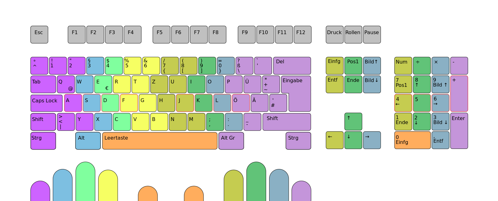

# Code for life 

> code-for-life is very begining note for developer. At the moment, it just support for ubuntu 18.04. I need a help to improve code-for-life become a note for every developer on any platform.

It's time to stop using the mouse!

## Tools

### Chrome

| Extension | Description |
| ------ | ------ |
| [Vimnium](https://chrome.google.com/webstore/detail/vimium/dbepggeogbaibhgnhhndojpepiihcmeb) | The hacker's browser |
| [Grammarly](https://chrome.google.com/webstore/detail/grammarly-for-chrome/kbfnbcaeplbcioakkpcpgfkobkghlhen) | Automated Grammar Checker |
| [Google Translate](https://chrome.google.com/webstore/detail/google-translate/aapbdbdomjkkjkaonfhkkikfgjllcleb?hl=vi) | Translate selected text |
| [Redux devtool](https://chrome.google.com/webstore/detail/redux-devtools/lmhkpmbekcpmknklioeibfkpmmfibljd?hl=vi) | for reactjs developer |
| [Octotree](https://chrome.google.com/webstore/detail/octotree/bkhaagjahfmjljalopjnoealnfndnagc?hl=vi) | github tree viewer on browser |
| [Dark mode](https://chrome.google.com/webstore/detail/dark-mode/dmghijelimhndkbmpgbldicpogfkceaj?hl=vi) | Turn Chrome to Dark theme |
| [Google Search Keyboard Shortcuts ](https://chrome.google.com/webstore/detail/google-search-keyboard-sh/iobmefdldoplhmonnnkchglfdeepnfhd?hl=vi) | Quick navigate search result |
| [Multi-clock]() | Multi-clock in new tab |
| [Natural Reader Text to Speech](https://chrome.google.com/webstore/detail/natural-reader-text-to-sp/kohfgcgbkjodfcfkcackpagifgbcmimk) | Text to speech |

> Vimnium - The hacker's browser
```
Navigate Tab: 
    Quick Switch : Ctrl + Tab, Ctrl + Shift + Tab, Ctr + 1, Ctrl +9
    Open/Close   : Ctrl + T, Ctrl + W
    Google Search: O
    Using command: /
    Fullscreen   : f11
    Quick Link   : f
    More help    : ?
```
## Terminal 
### zsh
```
sudo apt install zsh
chsh -s $(which zsh)
# logout 
gnome-session-quit
```

### ohmyzsh
```
sh -c "$(curl -fsSL https://raw.githubusercontent.com/ohmyzsh/ohmyzsh/master/tools/install.sh)"
```
### tmux
```
https://github.com/gpakosz/.tmux
```
or quick install
```
sudo apt-get update
sudo apt-get install tmux
cd ~
git clone https://github.com/gpakosz/.tmux.git
ln -s -f .tmux/.tmux.conf
cp .tmux/.tmux.conf.local .
```
edit ~/.vimrc
```
# write this at the beginning of ~/.zshrc
if [ "$TMUX" = "" ]; then tmux; fi
```
add cpu plugin
```
tmux_conf_theme_status_right='#{prefix}#{pairing}#{synchronized}#[fg=green]#($TMUX_PLUGIN_MANAGER_PATH/tmux-mem-cpu-load/tmux-mem-cpu-load --colors --powerline-right --interval 2)#[default]#{sysstat_cpu}#{sysstat_mem}#{?battery_status, #{battery_status},}#{?battery_bar, #{battery_bar},}#{?battery_percentage, #{battery_percentage},} , %R , %d %b | #{username}#{root} | #{hostname} '

```
### Terminal Preferences
- Download fonts
https://fontlibrary.org/en/font/consolamono
> install this font using font manager
```
sudo apt install font-manager
```
> then apply it for terminal

#### Setup terminal Preferences
  + Theme : Dark
  + Uncheck show menu bar
  + Custom font: Consola Mono Book
  + Run command as login shell
  + Colors:
    - Background: #1C1C1C
    - Text: #CFBFAD
    - Bold text: #D33682
    - Build in schema: Tango

## Code IDE/editor
### vim8
```
sudo add-apt-repository ppa:jonathonf/vim
sudo apt update
sudo apt install vim
sudo apt install vim-gtk3 vim-nox
```
* native package
- https://github.com/sheerun/vim-polyglot
- https://github.com/sickill/vim-monokai
- https://github.com/codota/tabnine-vim

> Quick install native package in vim8, just clone a package and put in
```
~/.vim/pack/default/start
```

### Other suggestion
1. neovim 
```
sudo apt-get install ninja-build gettext libtool libtool-bin autoconf automake cmake g++ pkg-config unzip
git clone https://github.com/neovim/neovim.git
cd neovim
git checkout v0.4.4
make CMAKE_BUILD_TYPE=RelWithDebInfo
sudo make install

sudo npm install -g neovim

sudo apt update
sudo apt install ruby-full
sudo gem install neovim

sudo apt-get install python-pip
sudo apt-get install python3-pip
pip install neovim
pip3 install neovim
```
- Customize config
```
vi ~/.thinkvim.d/init.vim
```
then add this code
```
let g:spaceline_seperate_style= 'arrow'
```
2. thinkvim 
```
https://github.com/hardcoreplayers/ThinkVim
```
or quick install
```
git clone --depth=1 https://github.com/hardcoreplayers/ThinkVim.git ~/.config/nvim
cd ~/.config/nvim
bash scripts/install.sh
```
3. vscode
> https://code.visualstudio.com/download 

Extensions:
| Extension | Description |
| ------ | ------ |
| [AsciiDoc](https://marketplace.visualstudio.com/items?itemName=asciidoctor.asciidoctor-vscode) | Ascii docs |
| [Bookmark](http://github.com/alefragnani/vscode-bookmarks) | vscode bookmark |
| [Bracket Pair Colorizer](https://github.com/CoenraadS/Bracket-Pair-Colorizer-2) | Make colorize for bracket pair |
| [GitLens](https://marketplace.visualstudio.com/items?itemName=eamodio.gitlens) | Supercharge the Git capabilities  |
| [One Monokai Theme](https://marketplace.visualstudio.com/items?itemName=azemoh.one-monokai) | My theme |
| [StandardJS]() | JS linter  |
| [Tabnine]() | AI code suggestion |
| [TODO tree]() | TODO via explorer |
| [Vim]() | Vim |
| [vscode-icon]() | icon |
| [YAML]() | YAML formatter |

## Coding style
### GO 
```
https://github.com/uber-go/guide
```

### Javascript 
```
https://github.com/airbnb/javascript
```
## Shortcuts

### Bash
https://ss64.com/bash/syntax-keyboard.html

### Todos
 - Write MORE notes
### Issues
1. neovim
 - Nvim Theme is not good (pain my eyes)
 - Tabnine load too more ram
 - Does not support standardjs
 - Explorer still slowly

2. vim
 - multi cursor
 - format yaml
 - git diff/compare

### Tips

#### vim graphical cheat sheet


#### 10 finger style guide



License
----

MIT
